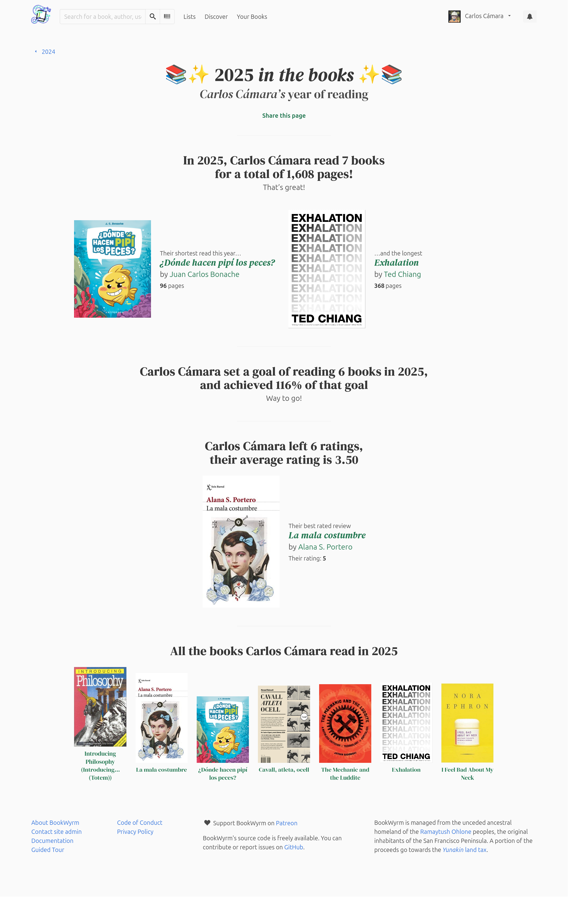
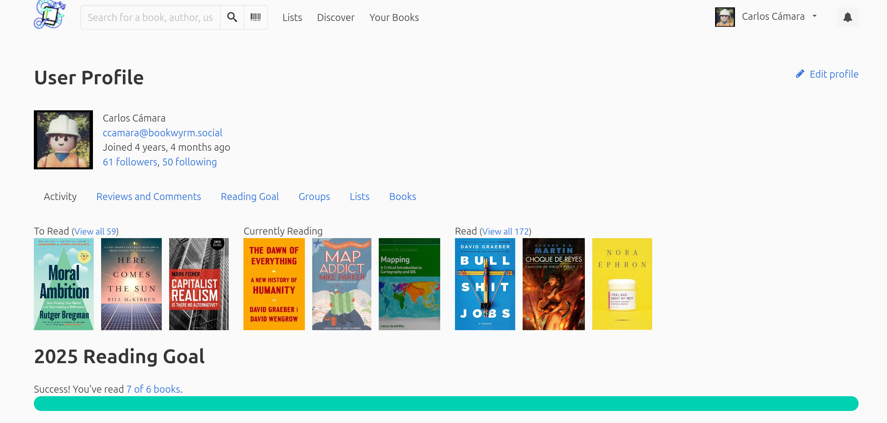

As a proponent of alternative social media and the [Fediverse](https://en.wikipedia.org/wiki/Fediverse) who happens to love books (although I read way less books than I'd love to), I was immediately in love when I heard about [Bookwyrm](https://joinbookwyrm.com/). Bookwyrm is "a social network for tracking your reading, talking about books, writing reviews, and discovering what to read next"[^1], but, unlike GoodReads, which is owned by Amazon, it is developed and maintained by a community of contributors led by [Mouse Reeve](https://www.mousereeve.com/), using a collaborative and anti-corporate[^2] approach. Another notable difference is that it is decentralised, which means that...

[^1]: Source: <https://joinbookwyrm.com>

[^2]: Bookwyrm uses an uncommon, and very concise [anti-capitalist license](https://raw.githubusercontent.com/bookwyrm-social/join-bookwyrm/main/LICENSE.md), which basically grants free use of the software and distribution to anyone that fits within these groups: An individual person, laboring for themselves; A non-profit organization; An educational institution; An organization that seeks shared profit for all of its members, and allows non-members to set the cost of their labor.

    While this is inclusive enough except for organisations seeking their own profit, it is restrictive enough not to be considered Free/Libre OpenSource.

Because of that, back in 2020 I created an account at [Bookwyrm.social](https://bookwyrm.social/) and I imported all my books and ratings from Goodreads and I've been very happy with it. Besides missing some friends here, I only miss one feature: I wish there were some data visualisations to provide insight about reading patterns. But, given that bookwyrm is collaborative, and given that I happen to be a data visualisation enthusiast, I took this not as a flaw but as an opportunity to contribute to an already excellent software, service and community. Given that I'm not very familiar neither with [django](https://www.djangoproject.com/) (the framework underlying Bookwyrm) nor with python, I'm going to use this as a proof of concept and an exercise to force myself to leave the comfort of my beloved R to create data visualisations and get familiar with [altair](https://altair-viz.github.io/index.html) for python. Hopefully, I will be able to ingrate this (or some parts) into bookwyrm, provided there's acceptance, and I receive some guidance.

So, this post serves three aims: First, I want to force myself to leave the comfort of my beloved R to create data visualisations and get familiar with atair for python. Second, I want to better understand my reading patterns and make informed decisions. And, third, I would want this to be useful for the bookwyrm community.

## Overview

[{#fig-year-review fig-alt="A hidden gem that only shows every December: The yearly summary"} A hidden gem that only shows every December: The yearly summary]{.aside}

Bookwyrm has a nice way to show how users are progressing in their reads, as shown in their user profiles (@fig-profile-overview) or in the yearly summary that only appears every December. Even though they are very visual and well made, I am missing a visual summary that answers questions such as:

-   How much have I read this year? How does it compare in relation to my previous history?

-   And speaking of which... How does my reading history look like? Who are my favourite authors? What do I read, do I prefer long books or short ones? Do I prefer recent ones or classics?

{#fig-profile-overview fig-alt="User profile showing books stored in shelves and progress made."}

To answer these questions we will be using Bookyrm's feature to export the reading history as a `.csv`, which, in my case, looks like this:

```{python}
#| label: setup
#| column: page

import pandas as pd
import altair as alt
import requests
import time
import geopandas as gpd

from datetime import datetime
from typing import Iterable, List, Optional, Dict, Set

# Load world map for later use
gdf = gpd.read_file('posts/2024-01_bookwyrm-vis/data/ne_110m_admin_0_countries.zip')


col_bw_green = "#00D1B2"

# Load books' dataset
books_df = pd.read_csv(
    "posts/2024-01_bookwyrm-vis/data/bookwyrm-export.csv", 
    parse_dates=['shelf_date', 'start_date', 'finish_date', 'stopped_date']
)

books_df = books_df.sort_values('shelf_date')

# Filter for rows where shelf is 'read'
books_read_df = books_df[books_df['shelf'] == 'read'].copy()

books_df.head()
```

### How much have I read this year? How does it compare to previous years?

I wanted to create a text that summarises the reading history with some relevant figures such as number of books and pages read, number of authors, and time frame. All this data is available in the dataset, but given that a book may have more than one author, I needed to separate the authors in different rows. This will also be useful to identify my favourite authors later.

```{python}
#| label: tbl_def_books_data
#| tbl-cap: The exploded dataset, where authors have been separated and we have one author per row.
#| column: page

books_df_exploded = (
    books_df
    .dropna(subset=['author_text', 'shelf'])
    .assign(author_text=lambda d: d['author_text'].str.split(','))
    .explode('author_text')
    .assign(author_text=lambda d: d['author_text'].str.strip())
    .loc[lambda d: d['author_text'] != '']
    .drop_duplicates() # Some authors are duplicate in bookwyrm, so removing duplicate names.
    .reset_index(drop=True)
)

# Generate an authors dataframe
authors = books_df_exploded['author_text'].drop_duplicates()

authors_summary = (
    books_df_exploded
    .groupby(['author_text', 'shelf'], as_index=False)
    .agg(pages_total=('pages','sum'), n=('author_text','count'))
    .sort_values('pages_total', ascending=False)
)

books_df_exploded.head()
```

And with this, we can compute some basic statistics to generate the text below:

```{python}
#| label: overview-stats
total_pages = int(round(books_read_df['pages'].sum()))
total_books = books_read_df.shape[0]

date_start = books_read_df['finish_date'].min().date().year
date_end = books_read_df['finish_date'].max().date().year

total_authors = authors.shape[0]

books_year = round(total_books / (date_end - date_start))
pages_year = round(total_pages / (date_end - date_start))

# f"Since {date_start}, I have read a total of {total_books} books and {total_pages} pages, authored by {total_authors} different authors."
```

> **Since `{python} date_start`, I have read a total of `{python} total_books` books from `{python} total_authors` different authors, accounting `{python} total_pages` pages. This averages to `{python} books_year` books per year and `{python} pages_year` pages per year.**

While this text provides very interesting figures, it has two main issues: it is not very visual, and it only provides a global snapshot that does not show how has it changed with the years. Also, it is only based on quantiative data and suggest a capitalist approach: more is better. I'll be talking more on this later.

So let's create a data visualisation that shows **reading over time**. But how do we define and measure "readings over time"? Usually, the metrics used for that are number of books per year and number of pages, and usually they are presented as barplots that show one of the other. This is tricky, because one year we may have read several short books while the next one we may have read less, but longer ones. To overcome this, I wanted to have a single plot where I could see both metrics simultaneously, so I decided to use a lollypop plot (@fig-reads-year):

```{python}
#| label: fig-reads-year
#| fig-cap: "Number of books and pages read by year"
#| column: page-left

# Prepare dataframe
books_read_df_year = books_read_df.copy()
# Assign books with no pages a value = mean pages.
books_read_df_year['pages'] = books_read_df_year['pages'].fillna(
  books_read_df_year['pages'].mean().round())
  
books_read_df_year = (
    books_read_df_year
    .assign(year=books_read_df_year['finish_date'].dt.year)          # extract year
    .groupby('year')
    .agg(
        books=('pages', 'size'),               # number of rows = books
        pages_sum=('pages', 'sum')             # total pages per year
    )
    .reset_index()
)

# Create lollypop plot in two steps: bars and dots
bars = alt.Chart(books_read_df_year).mark_bar(
    size=2, 
    color=col_bw_green
).encode(
    x=alt.X(
        'year:Q',
        title='',
        axis=alt.Axis(format='d', tickCount=5)
    ),
    y=alt.Y(
        'books:Q', 
        title='Number of books read'
    ),
)

points=alt.Chart(books_read_df_year).mark_point(
    filled=True,
    color=col_bw_green
).encode(
    x=alt.X(
        'year:Q',
        title='',
        axis=alt.Axis(format='d', tickCount=5)
    ),
    y=alt.Y(
        'books:Q', 
        title='Number of books read'
    ),
    size=alt.Size('pages_sum:Q', title='Number of pages')
)

(bars+points).encode(
    tooltip=[
        alt.Tooltip('year:Q', title='Year', format='d'),
        alt.Tooltip('books:Q', title='Books Read'),
        alt.Tooltip('pages_sum:Q', title='Pages Read')
    ] 
).properties(
    width=700,
    height=400,
    title='Number of books and pages read by year'
).interactive()
```

This plot provides a lot of information, and it allows identifying years like 2013, where I was very active (first year of my PhD!) and years like 2009 where I didn't record any read.

::: {.callout-caution collapse="true" appearance="simple"}
### To improve...

There are some things I would want to improve from this plot, but I have not yet figured out how to do it.

The first one is that the bubble in 2013 gets trimmed and I hate it. Apparently, Altair uses the maximum value as axis range by default. This means that the point does not fit within the range and gets trimmed. I would want to learn how to avoid this by adding some extra padding on top of the maximum value.

The second thing I would want to do has to do with the axis range, in this case, the X. Because I set that I wanted ticks to be shown every 5 years, Altair has defined the range to be multiple of 5, meaning that it will stop in 2030, even though the maximum date is 2025.

The third one is that I would want to add an horizontal legend, just below the title, and align the title, too. Ideally creating a theme that I can reuse in every subsequent plot.
:::

## How does my reading history look like?

This is a very broad question, as there are many ways to define what "reading history" may mean. One way could be to show who are my favourite authors, the languages I read, or whether I prefer reading short books over long ones, or the other way around.

### Favourite authors

Again, here we can define favourite authors based on number of read books, or pages, so let's create a plot for each metric. Or even better, I can follow the same pattern and create a lollypop with both metrics.

::: panel-tabset
#### Books and pages

```{python}
#| label: fig-top-authors
#| fig-cap: Top authors by number of read books and pages
top_authors = authors_summary[authors_summary['shelf'] == 'read'].nlargest(20, 'n').reset_index(drop=True)

# Bar layer: count of books per year
bars = (
    alt.Chart(top_authors)
    .mark_bar(size=2, color= col_bw_green)
    .encode(
        x=alt.X("n:Q", title="Number of books"),
        y=alt.Y("author_text:N", title="", sort="-x")
    )
) 

# Point layer: size reflects total pages
points = (
    alt.Chart(top_authors)
    .mark_point(filled=True, color=col_bw_green)
    .encode(
        x=alt.X(
          "n:Q", 
          title="Number of books",
          axis=alt.Axis(tickCount=top_authors['n'].max() +1),
        ),
        y=alt.Y("author_text:N", title="", sort="-x"),
        size=alt.Size('pages_total:Q',
                    scale=alt.Scale(range=[30, 300]),   # adjust visual range
                    legend=alt.Legend(title='Total pages')),
        #opacity=alt.condition(hover, alt.value(1), alt.value(0.6)),
    )
)

# Combine layers
chart = (bars + points).properties(
    width=550,
    height=400,
    title='Most read authors'
).encode(
  tooltip=[
        alt.Tooltip('n:Q', title='Books read'),
        alt.Tooltip('pages_total:Q', title='Pages total')
  ]
).interactive()   # enables pan/zoom

chart
```

#### By books

```{python}
#| label: fig-top-authors-books
#| fig-cap: Top authors by number of read books
top_authors_books = authors_summary[authors_summary['shelf'] == 'read'].nlargest(15, "n").reset_index(drop=True)

# build horizontal bar chart (largest at top)
chart = (
    alt.Chart(top_authors_books)
    .mark_bar(color=col_bw_green)
    .encode(
        x=alt.X(
            "n:Q", title="Reads (total)",
            axis=alt.Axis(tickCount=top_authors_books['n'].max())
        ),
        y=alt.Y("author_text:N", title="", sort="-x"),
        tooltip=[
            alt.Tooltip("author_text:N", title="Author"),
            alt.Tooltip("n:Q", title="Books")
        ],
    )
    .properties(width=650, height=350, title="Top 15 Authors by # Books")
    .configure_title(fontSize=14, anchor="start")
)

chart
```

#### By pages

```{python}
#| label: fig-top-authors-page
#| fig-cap: Top authors by number of read pages
top_authors_pages = authors_summary[authors_summary['shelf'] == 'read'].nlargest(15, "pages_total").reset_index(drop=True)

# build horizontal bar chart (largest at top)
chart = (
    alt.Chart(top_authors_pages)
    .mark_bar(color=col_bw_green)
    .encode(
        x=alt.X("pages_total:Q", title="Pages (total)"),
        y=alt.Y("author_text:N", title="", sort="-x"),
        tooltip=[
            alt.Tooltip("author_text:N", title="Author"),
            alt.Tooltip("pages_total:Q", title="Pages total")
        ],
    )
    .properties(width=650, height=350, title="Top 15 Authors by Pages Read")
    .configure_title(fontSize=14, anchor="start")
)

chart
```

### By ratings

It would be good to show which are the authors that I've voted the best.
:::

::: {.callout-note collapse="false" appearance="simple"}
One thing I can get from @fig-top-authors-books is that I tend not to favour some authors, and besides few exceptions such as Game of Thrones and the Lord of The Rings, I do not like book series.
:::

### How long are my reads?

Histogram about how long the books tend to be

```{python}
alt.Chart(books_df).mark_bar(color=col_bw_green).encode(
    alt.X("pages:Q", bin=True),
    y='count()',
)
```

### Reads by language

```{python}
#| label: fig-books-language
#| fig-cap: Languages read by books and pages

books_read_df_lang = (
    books_read_df
    .groupby('language', as_index=False)
    .agg(
        books=('pages', 'size'),               # number of rows = books
        pages_sum=('pages', 'sum')             # total pages per year
    )
    .sort_values('books', ascending=False)
)

# Bar layer: count of books per year
bars = (
    alt.Chart(books_read_df_lang)
    .mark_bar(size=2, color= col_bw_green)
    .encode(
        x=alt.X("books:Q", title="Number of books"),
        y=alt.Y("language:N", title="", sort="-x")
    )
) 

# Point layer: size reflects total pages
points = (
    alt.Chart(books_read_df_lang)
    .mark_point(filled=True, color=col_bw_green)
    .encode(
        x=alt.X("books:Q", title="Number of books"),
        y=alt.Y("language:N", title="", sort="-x"),
        size=alt.Size('pages_sum:Q',
                    scale=alt.Scale(range=[30, 300]),   # adjust visual range
                    legend=alt.Legend(title='Total pages')),
        #opacity=alt.condition(hover, alt.value(1), alt.value(0.6)),
    )
)

# Combine layers
chart = (bars + points).encode(
    tooltip=[
        alt.Tooltip('language:N', title='Language'),
        alt.Tooltip('books:Q', title='Books Read'),
        alt.Tooltip('pages_sum:Q', title='Pages Read')
    ] 
).properties(
    width=650,
    height=200,
    title='Books by language'
).interactive()   # enables pan/zoom

chart
```

This shows that I only read in three languages. Besides reading less books in Catalan, I have read more pages in that language.

### Do I prefer old or newer books?

```{python}
#alt.Chart()
```

### Ratings distribution

```{python}
alt.Chart(books_read_df).mark_bar(
    color=col_bw_green
).encode(
    x = alt.X(
        'rating', 
        title='Rating',
        axis=alt.Axis(tickCount=5),
    ),
    y = alt.Y('count()')
)

```

I tend to like what I read, and I'm not usually a harsh critic, although it is also true that I do not give high-score ratings for free.

```{python}
alt.Chart(books_read_df, title='Normally distributed jitter').mark_circle(size=8).encode(
    y="rating",
    x="finish_date",
    yOffset="jitter:Q",
    color=alt.Color('rating:N').legend(None)
).transform_calculate(
    # Generate Gaussian jitter with a Box-Muller transform
    jitter="sqrt(-2*log(random()))*cos(2*PI*random())"
)

```

## Incorporating an EDI reading to my reading history

As useful as the previous plots are, they have an important flaw: they approach reading from a merely quantative standpoint,suggesting that more = better. Reading should be way more than consuming books, so, following Bookwyrm's ethos, I wanted to produce some data visualisations that help me reflect on the diversity of my readings, and inform decisions to decolonise them.

To do so, I needed to retrieve information about authors that is missing from the bookwyrm's exported dataset, such as country of birth, gender, ethnicity or sexual orientation. Some of those details are stored in Bookwyrm's database, but many others are not, so I decided to retrieve that information from Wikidata.

The code below does that in several stages: first, checks if the authors' properties is already stored in a dataset. If they are missing, it will retrieve wikidata's QIDs based on the author's namesretrieves those properties from wikidata provides an approach to retrieve authors' Wikidata QIDs based on their names, and then retrieve relevant properties for those QIDs.

```{python}
#| label: wikidata-qid-definition

WIKIDATA_SEARCH_URL = "https://www.wikidata.org/w/api.php"
WIKIDATA_SPARQL_URL = "https://query.wikidata.org/sparql"
HEADERS = {"User-Agent": "dslabs-wikidata-query/1.0 (contact: youremail@example.com)"}

PREF_OCC_WRITER = "Q36180"     # writer
PREF_OCC_NOVELIST = "Q6625963" # novelist
HUMAN_Q = "Q5"

def wbsearch_candidates(name: str, language: str = "en", limit: int = 5, timeout: int = 30) -> List[str]:
    """
    Given a name string, return a list of candidate QIDs from Wikidata search.
    """
    if name is None or (isinstance(name, float) and pd.isna(name)) or str(name).strip() == "":
        return []
    params = {
        "action": "wbsearchentities",
        "format": "json",
        "language": language,
        "search": name,
        "type": "item",
        "limit": limit
    }
    resp = requests.get(WIKIDATA_SEARCH_URL, params=params, headers=HEADERS, timeout=timeout)
    resp.raise_for_status()
    data = resp.json()
    return [item["id"] for item in data.get("search", []) if "id" in item]

def query_human_occupations_for_qids(qids: Iterable[str], timeout: int = 60) -> Dict[str, Set[str]]:
    """
    Given an iterable of QIDs (e.g. ['Q123','Q456']), return a mapping
    qid -> set of occupation QIDs for items that are humans (P31 = Q5).

    Items that are not humans will NOT appear in the mapping.
    """
    qid_list = [q for q in qids]
    if not qid_list:
        return {}
    values = " ".join(f"wd:{q}" for q in qid_list)
    sparql = f"""
    SELECT ?item ?occ WHERE {{
      VALUES ?item {{ {values} }}
      ?item wdt:P31 wd:{HUMAN_Q}.
      OPTIONAL {{ ?item wdt:P106 ?occ. }}
    }}
    """
    resp = requests.get(WIKIDATA_SPARQL_URL, params={"query": sparql, "format": "json"}, headers=HEADERS, timeout=timeout)
    resp.raise_for_status()
    results = resp.json().get("results", {}).get("bindings", [])
    mapping: Dict[str, Set[str]] = {}
    for row in results:
        item_url = row["item"]["value"]
        qid = item_url.rsplit("/", 1)[-1]
        occ_val = row.get("occ")
        occ_qid = None
        if occ_val:
            occ_qid = occ_val["value"].rsplit("/", 1)[-1]
        mapping.setdefault(qid, set())
        if occ_qid:
            mapping[qid].add(occ_qid)
    return mapping

def choose_preferred_qid(candidates: List[str], human_occ_map: Dict[str, Set[str]]) -> Optional[str]:
    """
    Given candidate IDs (in search order) and a mapping of human QIDs to their occupation sets,
    return a single preferred qid or None.
    Preference order:
      1) first candidate that is human and has occupation writer (Q36180)
      2) first candidate that is human and has occupation novelist (Q6625963)
      3) first candidate that is human (any occupation)
      4) else None
    """
    # 1) writer
    for q in candidates:
        occs = human_occ_map.get(q)
        if occs and PREF_OCC_WRITER in occs:
            return q
    # 2) novelist
    for q in candidates:
        occs = human_occ_map.get(q)
        if occs and PREF_OCC_NOVELIST in occs:
            return q
    # 3) any human
    for q in candidates:
        if q in human_occ_map:
            return q
    return None

def resolve_name_to_qid(name: str, pause_seconds: float = 0.5) -> Optional[str]:
    """
    Resolve a single name to a preferred QID following the rules described.
    """
    candidates = wbsearch_candidates(name)
    if not candidates:
        return None
    # Query occupations for all candidates at once and restrict to humans
    human_occ_map = query_human_occupations_for_qids(candidates)
    chosen = choose_preferred_qid(candidates, human_occ_map)
    time.sleep(pause_seconds)
    return chosen

def get_authors_qids(names: Iterable[str], pause_seconds: float = 0.5) -> pd.DataFrame:
    """
    Resolve an iterable of names to QIDs. Returns DataFrame with columns:
      - author_text: the original name
      - qid: chosen QID or None
    Maintains the order of first appearance of unique names in `names`.
    """
    seen = {}
    records = []
    for name in pd.Index(list(names)):
        if pd.isna(name) or str(name).strip() == "":
            records.append({"author_text": name, "qid": None})
            continue
        if name in seen:
            records.append({"author_text": name, "qid": seen[name]})
            continue
        qid = resolve_name_to_qid(name, pause_seconds=pause_seconds)
        seen[name] = qid
        records.append({"author_text": name, "qid": qid, "query_date": datetime.today().strftime('%Y-%m-%d')})
    return pd.DataFrame.from_records(records)


# test_names_series = ['Mike Parker', 'J.K. Rowling', 'Mark Fisher', 'Mark Graham', 'Unknown Author', None, '']


```

```{python}
#| label: authors_metadata


# Retrieve wikidata properties for authors with known QIDs from previous step.
def get_props_for_qid(qid: str, retries: int = 2, timeout: int = 60) -> Dict[str, Optional[str]]:
    if qid is None or (isinstance(qid, float) and pd.isna(qid)) or str(qid).strip() == "":
        return {
            "country_of_birth": None,
            "gender": None,
            "country_of_citizenship": None,
            "ethnicity": None,
            "sexual_orientation": None,
            "date_of_birth": None,
            "date_of_death": None
        }

    q = f"""
    SELECT ?genderLabel ?countryLabel ?countryCitizenshipLabel ?ethnicityLabel ?sexOrientLabel ?dob ?dod WHERE {{
      OPTIONAL {{ wd:{qid} wdt:P21 ?gender. }}
      OPTIONAL {{ wd:{qid} wdt:P19 ?place. ?place wdt:P17 ?country. }}
      OPTIONAL {{ wd:{qid} wdt:P27 ?countryCitizenship. }}
      OPTIONAL {{ wd:{qid} wdt:P172 ?ethnicity. }}
      OPTIONAL {{ wd:{qid} wdt:P91 ?sexOrient. }}
      OPTIONAL {{ wd:{qid} wdt:P569 ?dob. }}
      OPTIONAL {{ wd:{qid} wdt:P570 ?dod. }}
      SERVICE wikibase:label {{ bd:serviceParam wikibase:language "en". }}
    }}
    LIMIT 1
    """

    attempt = 0
    while True:
        try:
            resp = requests.get(WIKIDATA_SPARQL_URL, params={"query": q, "format": "json"}, headers=HEADERS, timeout=timeout)
            if resp.status_code == 200:
                data = resp.json()
                bindings = data.get("results", {}).get("bindings", [])
                if not bindings:
                    return {
                        "country_of_birth": None,
                        "gender": None,
                        "country_of_citizenship": None,
                        "ethnicity": None,
                        "sexual_orientation": None,
                        "date_of_birth": None,
                        "date_of_death": None
                    }
                row = bindings[0]
                def _get(key):
                    v = row.get(key)
                    return v.get("value") if v else None
                return {
                    "country_of_birth": _get("countryLabel"),
                    "gender": _get("genderLabel"),
                    "country_of_citizenship": _get("countryCitizenshipLabel"),
                    "ethnicity": _get("ethnicityLabel"),
                    "sexual_orientation": _get("sexOrientLabel"),
                    "date_of_birth": _get("dob"),
                    "date_of_death": _get("dod")
                }
            elif resp.status_code in (429, 503):
                # rate limited or service unavailable: back off and retry
                attempt += 1
                if attempt > retries:
                    return {k: None for k in ["country_of_birth","gender","country_of_citizenship","ethnicity","sexual_orientation","date_of_birth","date_of_death"]}
                time.sleep(2 ** attempt)
                continue
            else:
                resp.raise_for_status()
        except (requests.RequestException, ValueError):
            attempt += 1
            if attempt > retries:
                return {k: None for k in ["country_of_birth","gender","country_of_citizenship","ethnicity","sexual_orientation","date_of_birth","date_of_death"]}
            time.sleep(1 + attempt)

def crate_wikidata_properties_df(qid_df: pd.DataFrame, qid_col: str = "qid", author_col: str = "author_text", pause_seconds: float = 0.5) -> pd.DataFrame:
    """
    Given a dataframe with columns `author_text` and `qid`, query Wikidata for each qid
    and return a new dataframe with the following columns:
      - author_text
      - qid
      - country_of_birth
      - gender
      - country_of_citizenship
      - ethnicity
      - sexual_orientation
      - date_of_birth
      - date_of_death

    The function preserves the order of rows in `qid_df`. If `qid` is missing or invalid,
    property values will be None.
    """
    required_cols = [author_col, qid_col]
    for c in required_cols:
        if c not in qid_df.columns:
            raise KeyError(f"Column {c!r} not found in qid_df")

    records = []
    for _, row in qid_df.iterrows():
        author = row[author_col]
        qid = row[qid_col]
        props = get_props_for_qid(qid)
        # be polite to the wikidata servers
        time.sleep(pause_seconds)
        record = {"author_text": author, "qid": qid}
        record.update(props)
        records.append(record)

    return pd.DataFrame.from_records(records)

# Example usage:
#result_df = crate_wikidata_properties_df(qid_df, qid_col='qid', author_col='author_text', pause_seconds=0.6)

#result_df.to_csv('posts/2024-01_bookwyrm-vis/data/authors_wikidata_properties.csv', index=False)


```

```{python}
#| label: def_authors_data

# Retrieve authors' Wikidata QIDs
# Run the function for authors that we do not know their QIDs yet.

authors_qids_csv = 'posts/2024-01_bookwyrm-vis/data/authors_wikidata_qids.csv'

qid_df=pd.read_csv(authors_qids_csv)

new_authors = list(set(authors.to_list()).difference(qid_df['author_text'].to_list()))

if len(new_authors)> 0:
    qid_df_new = get_authors_qids(new_authors, pause_seconds=0.5)
    qid_df_new['query_date'] = datetime.today().strftime('%Y-%m-%d')
    # Append new authors and QIDs to existing dataframe and save it.
    qid_df = pd.concat([qid_df, qid_df_new]).reset_index(drop=True)
    qid_df.to_csv(authors_qids_csv, index=False)

# Cleanup
del(new_authors)

# Retrieve authors' Wikidata properties

# Run the function for authors that we do not know their properties yet.

authors_props_csv = 'posts/2024-01_bookwyrm-vis/data/authors_wikidata_properties.csv'

wikidata_props_df=pd.read_csv(authors_props_csv)

new_props = list(set(qid_df['author_text'].to_list()).difference(wikidata_props_df['author_text'].to_list()))

if len(new_props) > 0:
    new_props = pd.DataFrame(new_props, columns = ['author_text'])

    new_props = pd.merge(
        new_props,
        qid_df,
        on = 'author_text',
        how = 'left'
    )

    wikidata_props_df_new = crate_wikidata_properties_df(new_props, qid_col='qid', author_col='author_text', pause_seconds=0.6)

    get_authors_qids(new_props, pause_seconds=0.5)

    # Append new authors and QIDs to existing dataframe and save it.
    wikidata_props_df = pd.concat([wikidata_props_df, wikidata_props_df_new]).reset_index(drop=True)
    
    wikidata_props_df.to_csv(authors_props_csv, index=False)

wikidata_props_df

```

### Gender diversity

Now that I have queried wikidata to retrieve metadata about authors, I can replicate @fig-top-authors, but also showing the gender of my top authors, making it even more insightful!

```{python}

top_authors = authors_summary[authors_summary['shelf'] == 'read'].nlargest(20, 'n').reset_index(drop=True)

top_authors_metadata = pd.merge(
    top_authors,
    wikidata_props_df,
    left_on="author_text",
    right_on='author_text',
    how="left"
).copy()

# Bar layer: count of books per year
bars = (
    alt.Chart(top_authors_metadata)
    .mark_bar(size=2, color= col_bw_green)
    .encode(
        x=alt.X("n:Q", title="Number of books"),
        y=alt.Y("author_text:N", title="", sort="-x"),
        color="gender:N",
        tooltip=[
            alt.Tooltip('n:Q', title='Books read'),
            alt.Tooltip('pages_total:Q', title='Pages total')
        ]
    )
) 

# Point layer: size reflects total pages
points = (
    alt.Chart(top_authors_metadata)
    .mark_point(filled=True, color=col_bw_green)
    .encode(
        x=alt.X("n:Q", title="Number of books"),
        y=alt.Y("author_text:N", title="", sort="-x"),
        color="gender:N",
        size=alt.Size('pages_total:Q',
                    scale=alt.Scale(range=[30, 300]),   # adjust visual range
                    legend=alt.Legend(title='Total pages')),
        #opacity=alt.condition(hover, alt.value(1), alt.value(0.6)),
        tooltip=[
            alt.Tooltip('n:Q', title='Books read'),
            alt.Tooltip('pages_total:Q', title='Pages total')
        ]
    )
)

 
# Combine layers
chart = (bars + points).properties(
    width=600,
    height=400,
    title='Most read authors'
).interactive()   # enables pan/zoom

chart
```

### Authors by gender and time

And similarly, it would be interesting to see if the proportion of authors' genders has improved over time[^3]

[^3]: Sadly, this is not my case. While some relative improvement can be seen over years to favour female authors, my reading history is still very biased.

::: panel-tabset
#### Bar

```{python}
#| label: fig-authors-gender-bar

books_metadata_df = pd.merge(
    books_df,
    wikidata_props_df,
    on = 'author_text',
    how = 'left'
).drop_duplicates()


# Assuming books_df is your dataframe with columns: finish_date, author_text, gender
# Extract year from finish_date
books_metadata_df['year'] = pd.to_datetime(books_metadata_df['finish_date']).dt.year
books_metadata_df['gender'] = books_metadata_df['gender'].fillna('Unknown')

# Count books by year and gender 
gender_by_year = books_metadata_df.groupby(['year', 'gender']).size().reset_index(name='count')

# Calculate percentage for each gender within each year
gender_by_year['total_by_year'] = gender_by_year.groupby('year')['count'].transform('sum')
gender_by_year['percentage'] = (gender_by_year['count'] / gender_by_year['total_by_year']) * 100

# Create a normalized stacked bar chart
alt.Chart(gender_by_year).mark_bar(
    size=12,
    opacity=0.8
).encode(
    color=alt.Color('gender'),
    x=alt.X(
        'year:Q',
        title='',
        axis=alt.Axis(format='d', tickCount=10)
    ),
    y=alt.Y('percentage:Q',
            title='',
            stack='normalize',
            axis=alt.Axis(format='.0f')),
    tooltip=[
        alt.Tooltip('year:Q', title='Year', format='d'),
        alt.Tooltip('gender:N', title='Gender'),
        alt.Tooltip('count:Q', title='Books Read'),
        alt.Tooltip('percentage:Q', title='Percentage', format='.1f')
    ]
).properties(
    width=600,
    height=400,
    title="Books by author's gender and year"
).interactive()

```

#### Area

```{python}
#| label: fig-authors-gender-area


# Create normalized stacked area chart
chart = alt.Chart(gender_by_year).mark_area(
    opacity=0.8,
    #interpolate='monotone'
).encode(
    x=alt.X('year:Q', 
            title='',
            axis=alt.Axis(format='d', tickCount=5)),
    y=alt.Y('percentage:Q',
            title='',
            stack='normalize',
            axis=alt.Axis(format='.0f')),
    color=alt.Color('gender:N',
                    title='Gender',
                    scale=alt.Scale(scheme='category10')),
    tooltip=[
        alt.Tooltip('year:Q', title='Year', format='d'),
        alt.Tooltip('gender:N', title='Gender'),
        alt.Tooltip('count:Q', title='Books Read'),
        alt.Tooltip('percentage:Q', title='Percentage', format='.1f')
    ]
).properties(
    width=700,
    height=400,
    title='Author Gender Distribution Over Time (Normalized)'
).interactive()

chart

```
:::

### Cultural diversity

Books give a great opportunity to being exposed to world views from peoples and cultures that are very different from ours and would be very difficult to . Therefore, an important story to be told is how culturally rich is someone's reading history. This is something that would be extremely appreciated for anyone interested in decolonising their libraries, or simply acknowledge how diverse (or not) their readings are.

One way to approach diversity is based on someone's country of birth. This is an assumption that comes with several caveats, as it does not necessarily reflect the culture of the author, nor the fact that some countries are more multi-cultural than others, or the countries where authors were born may not exist anymore. In any case, I believe it is a good starting point.

The obvious thing to do would be to simply count the number of authors per country and present them in a visualisation (ideally, a map). This is exactly what I did in @fig-authors-map, but this assumes that all authors are equally important, which could be contested. A possible way to overcome that is to weight authors by how influencial for the reader have been, either by number of pages or books in the library.


```{python}


# Aggregate authors by country, weighting by `pages_total`.
# Resulting dataframe has one row per `country_of_birth` with:
#  - total_pages: sum of pages_total for authors from that country
#  - total_books: sum of `n` (books) for authors from that country
#  - n_authors: number of unique authors from that country
authors_country = (
    authors_summary[authors_summary['shelf'] == 'read']
    .merge(wikidata_props_df, on='author_text', how='left')
    # Remove empty values in country_of_birth
    .loc[lambda df: df['country_of_birth'].notna()]
    .groupby('country_of_birth', as_index=True)
    .agg(
        total_pages=('pages_total', 'sum'),
        total_books=('n', 'sum'),
        n_authors=('author_text', 'nunique')
    )
    .sort_values('total_pages', ascending=False)
    .reset_index()
)

gdf = gdf.merge(
    authors_country,
    left_on='NAME_LONG',
    right_on='country_of_birth',
    how='left'
)

# Creating a basemap for all the other options
basemap = alt.Chart(gdf).mark_geoshape(
    fill='lightgray',
    stroke='white'
).project(
    "equirectangular"
).properties(
    width=600,
    height=400
)


```


::: panel-tabset
#### Weighted by number of books

```{python}
#| label: fig-authors-map-books

choro_books = alt.Chart(gdf).mark_geoshape(stroke='white').encode(
    alt.Color('total_books:Q', 
              type='quantitative', 
              scale=alt.Scale(scheme='greens'),
              title = "# of Books"),
    tooltip=[
        alt.Tooltip('NAME_LONG', title='Country'),
        alt.Tooltip('n_authors:Q', title='Number of Authors'),
        alt.Tooltip('total_books:Q', title='Number of Books'),
        alt.Tooltip('total_pages:Q', title='Total Pages Read')
    ]
).project(
    "equirectangular"
).properties(
    width=600,
    height=400,
    title='Total Books per Author\'s country of birth'
).interactive()

basemap + choro_books

```

#### Weighted by number of pages

```{python}
#| label: fig-authors-map-pages

choro_pages = alt.Chart(gdf).mark_geoshape(stroke='white').encode(
    alt.Color('total_pages:Q', 
              type='quantitative', 
              scale=alt.Scale(scheme='greens'),
              title = "# of pages"),
    tooltip=[
        alt.Tooltip('NAME_LONG', title='Country'),
        alt.Tooltip('n_authors:Q', title='Number of Authors'),
        alt.Tooltip('total_books:Q', title='Number of Books'),
        alt.Tooltip('total_pages:Q', title='Total Pages Read')
    ]
).project(
    "equirectangular"
).properties(
    width=600,
    height=400,
    title='Total Pages per Author\'s country of birth'
).interactive()

basemap + choro_pages
```


#### By authors (not weighted)

```{python}
#| label: fig-authors-map

choro_authors = alt.Chart(gdf).mark_geoshape(stroke='white').encode(
    alt.Color('n_authors:Q', 
              type='quantitative', 
              scale=alt.Scale(scheme='greens'),
              title = "# of authors"),
    tooltip=[
        alt.Tooltip('NAME_LONG', title='Country'),
        alt.Tooltip('n_authors:Q', title='Number of Authors'),
        alt.Tooltip('total_books:Q', title='Number of Books'),
        alt.Tooltip('total_pages:Q', title='Total Pages Read')
    ]
).project(
    "equirectangular"
).properties(
    width=600,
    height=400,
    title='Total Authors per country of birth'
).interactive()

basemap + choro_authors
```

:::


I should now multiply authors by number of books read from each author to get a better estimate of countries.

## Authors by language

```{python}
alt.Chart(books_df[books_df['shelf'] == 'read']).mark_bar(color=col_bw_green).encode(
    y=alt.Y("language:N", title="Language", sort = '-x'),
    x=alt.X('count()', title='Number of books'),
).properties(
    width=600, 
    height=400,
    title='Read Books by language'
)
```

## Some considerations about bookwyrm data

-   Due to lack of enough libraries than curate the database, Some books and authors are duplicated at bookwyrm.social. This means that books like <https://bookwyrm.social/book/957796> have two entries for each of the authors, so they are linked to/from the book's description. However, as they both refer to the same person (Even though bookwyrm.social treats them as different entities), the code filters removal. Ideally, there should be mechanisms in place to merge duplicated authors (and books!)

-   Lack of multilingual approach to authors and books

    -   Some authors are spelled differently: <https://github.com/bookwyrm-social/bookwyrm/issues/3278>

    -   Some languages are written in different names

-   This code had to query Wikidata to retrieve author's qid and, then, their properties. Given that Qid are stored in Bookywrm, it should be easier to retrieve their properties. Ideally, we would want to store some properties in Bookwyrm, though? (maybe populating them from wikidata, in a similar fashion to how populating book's properties from inventaire.

-   There's no field to store translators, editors... all humans related to a book are currently stored as authors, and that is missleading. Open an issue!